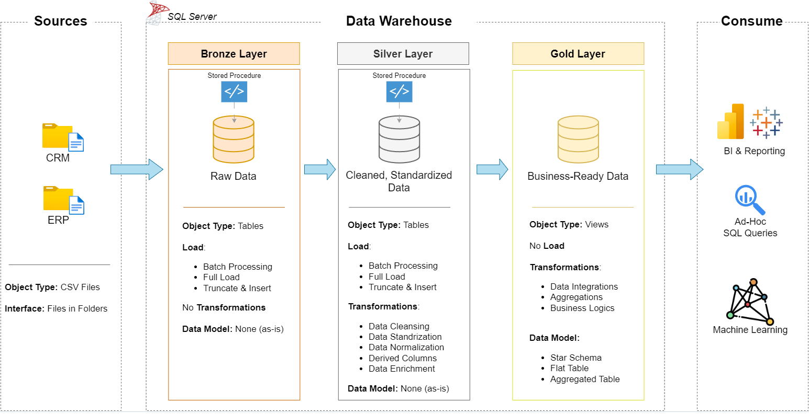

# Data Warehouse and Analytics Project

This project is a comprehensive, hands-on demonstration of building a modern data warehouse and analytics solution-from ingesting raw data to generating actionable business insights. I completed this project as a guided learning experience, following best practices in data engineering and analytics

---
## 🏗️ Data Architecture

The project implements the Medallion Architecture, featuring **Bronze**, **Silver**, and **Gold** layers:

- **Bronze Layer**: Stores raw data as-is from the source systems. Data is ingested from CSV files into a SQL Server database.
- **Silver Layer**: Cleanses, standardizes, and normalizes data to prepare it for analysis.
- **Gold Layer**: Contains business-ready, star-schema-modeled data for reporting and analytics.
  

---
## 📖 Project Overview

This project covers:

- **Data Architecture**: Designing a modern warehouse using Medallion Architecture (Bronze, Silver, Gold).
- **ETL Pipelines**: Extracting, transforming, and loading data from source systems into the warehouse.
- **Data Modeling**: Creating fact and dimension tables optimized for analytical queries.
- **Analytics & Reporting**: Developing SQL-based reports and dashboards for actionable insights.

This repository is ideal for showcasing skills in:

- SQL Development
- Data Architecture
- Data Engineering
- ETL Pipeline Development
- Data Modeling
- Data Analytics

---

## 🛠️ Tools & Resources

All resources used in this project are freely available:

- **Datasets**: Project datasets (CSV files) for ERP and CRM data.
- **SQL Server Express**: Lightweight server for hosting the SQL database.
- **SQL Server Management Studio (SSMS)**: GUI for managing and interacting with databases.
- **GitHub**: Version control and collaboration.
- **DrawIO**: Designing data architecture, models, and diagrams.
- **Notion**: Project management and documentation.
- **Notion Project Steps**: Detailed breakdown of all project phases and tasks.

---

## 🚀 Project Requirements

### Building the Data Warehouse (Data Engineering)

**Objective:**  
Develop a modern data warehouse using SQL Server to consolidate sales data for analytical reporting and informed decision-making.

**Specifications:**

- Import data from two source systems (ERP and CRM) provided as CSV files.
- Cleanse and resolve data quality issues before analysis.
- Integrate both sources into a single, user-friendly data model for analytics.
- Focus on the latest dataset only; historization is not required.
- Provide clear documentation of the data model for both business stakeholders and analytics teams.

### BI: Analytics & Reporting (Data Analysis)

**Objective:**  
Develop SQL-based analytics to deliver detailed insights into:

- Customer Behavior
- Product Performance
- Sales Trends

These analytics empower stakeholders with key business metrics for strategic decision-making.


## 📂 Repository Structure
```
data-warehouse-project/
│
├── datasets/                           # Raw datasets used for the project (ERP and CRM data)
│
├── docs/                               # Project documentation and architecture details
│   ├── etl.drawio                      # Draw.io file shows all different techniquies and methods of ETL
│   ├── data_architecture.drawio        # Draw.io file shows the project's architecture
│   ├── data_catalog.md                 # Catalog of datasets, including field descriptions and metadata
│   ├── data_flow.drawio                # Draw.io file for the data flow diagram
│   ├── data_models.drawio              # Draw.io file for data models (star schema)
│   ├── naming-conventions.md           # Consistent naming guidelines for tables, columns, and files
│
├── scripts/                            # SQL scripts for ETL and transformations
│   ├── bronze/                         # Scripts for extracting and loading raw data
│   ├── silver/                         # Scripts for cleaning and transforming data
│   ├── gold/                           # Scripts for creating analytical models
│
├── tests/                              # Test scripts and quality files
│
├── README.md                           # Project overview and instructions
├── LICENSE                             # License information for the repository
├── .gitignore                          # Files and directories to be ignored by Git
└── requirements.txt                    # Dependencies and requirements for the project
```
---


## 🌟 About Me
Hi! I am **Pavan**.
This project was completed as a guided learning journey, following along with Baraa Khatib Salkini’s excellent YouTube series and resources. The original project and instructional materials were created by **Baraa Khatib Salkini** (Data With Baraa).  
You can connect with me on [LinkedIn](https://www.linkedin.com/in/pavan0017/).

---

**Special thanks to Baraa for sharing his expertise and making data engineering accessible!**

